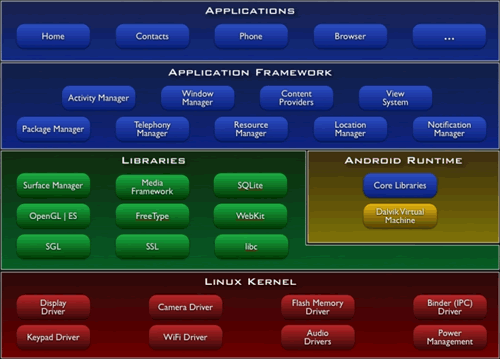

# Android-study
整理、记录Android学习计划，读书笔记等。

### [学习Android系统]

- **四大组件**
    - [Activity](android/activity.md)
    - Service
    - Content Provider
    - BroadcastReceiver
- **进程间通信机制**
    - Binder
    - 匿名共享内存
- View系统、Window系统，绘制原理，事件分发
- 动画框架
- 多线程机制，消息机制 AsyncTask，Thread/Handler
- 系统启动过程，system_server启动过程
- 资源管理系统，资源加载机制等

### Java
- **语言层面**：	《Effective Java》	《Java解惑》
- **虚拟机**：	 《深入理解Java虚拟机》	《实战Java虚拟机》
- **并发编程**：

### 了解编译原理等CS基本知识

###  深入Linux内核
