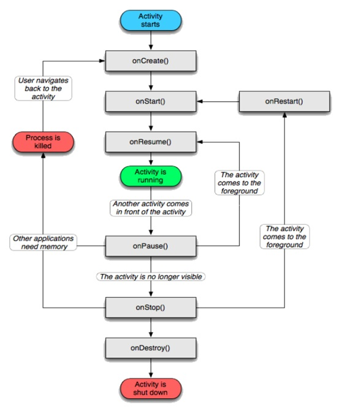

Activity
==========================

- 生命周期

- [LaunchMode](launchmode.md)

- **dumpsys activity**: 在adb shell命令下执行dumpsys activity activities，Activity是以栈的形式管理的， 每个栈中存在若干个任务（task）， 每个任务又由若干个Activity组成。