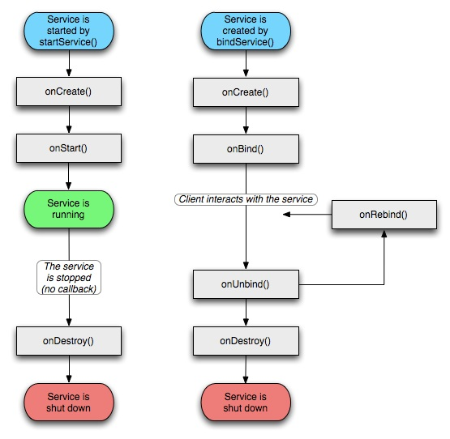

- Service后台运行
- Service运行在主线程，耗时的操作需要自己创建独立线程
- Service的优先级比较低，可能会回收掉。如果希望保持运行状态，可以考虑使用前台Service。
- 生命周期
	- 调用 Context.startService方法启动.被startService 方法多次启动，那么onCreate方法只会调用一次，onStart将会被调用多次（对应调用startService的次数）.该Service将会一直在后台运行，而不管对应程序的Activity是否在运行，直到被调用stopService，或自身的stopSelf方法。当然如果系统资源不足，android系统也可能结束服务。
	- Service被某个Activity 调用 Context.bindService 方法绑定启动，不管调用 bindService调用几次，onCreate方法调用一次，onStart不会被调用。调用Context.unbindService 断开连接或者之前调用bindService 的 Context 不存在了（如Activity被finish的时候），系统将会自动停止Service，对应onDestroy将被调用。
- IntentService
	- 会创建独立的worker线程来处理所有的Intent请求；
	- 会创建独立的worker线程来处理onHandleIntent()方法实现的代码，无需处理多线程问题；
	- 所有请求处理完成后，IntentService会自动停止，无需调用stopSelf()方法停止Service；
	- 为Service的onBind()提供默认实现，返回null；
	- 为Service的onStartCommand提供默认实现，将请求Intent添加到队列中；
- Service的种类
	- 本地服务， Local Service 用于应用程序内部。在Service可以调用Context.startService()启动，调用Context.stopService()结束。在内部可以调用Service.stopSelf() 或 Service.stopSelfResult()来自己停止。无论调用了多少次startService()，都只需调用一次stopService()来停止。
	- 远程服务， Remote Service 用于android应用程序间。可以AIDL定义接口并把接口暴露出来，以便其他应用进行操作。客户端建立到服务对象的连接，并通过那个连接来调用服务,连接到IService暴露给Client的Stub，获得stub对象。调用Context.bindService()方法建立连接，并启动，以调用 Context.unbindService()关闭连接。多个客户端可以绑定至同一个服务。如果服务此时还没有加载，bindService()会先加载它。Service通过接口中的Stub向client提供服务，在IService中对抽象IService.Stub具体实现。 