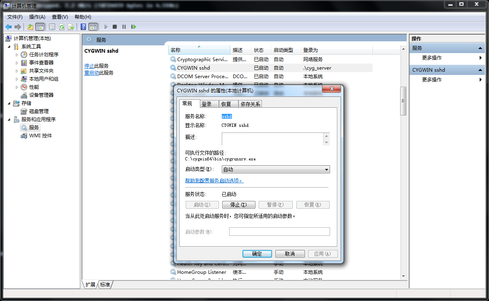
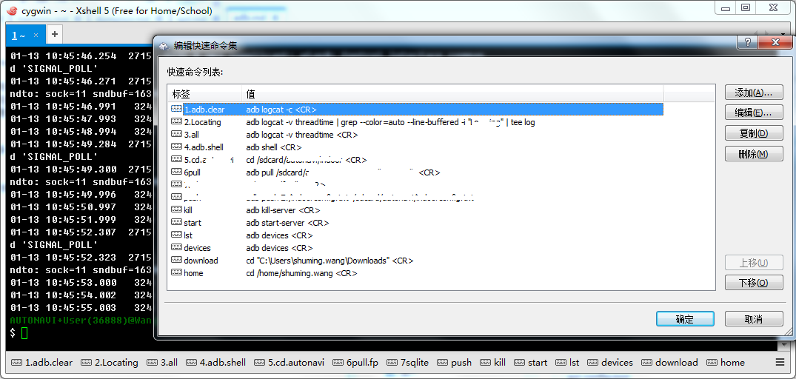

### Android 工作环境
Windows上调试Android程序比较麻烦，因为没有一套shell工具，毕竟Android也是Linux系统

1. cygwin64：提供了windows的模拟，安装的时候把常用的一些工具也都安装好，比如rsync， grep，vi,sshd 等等
2. Xshell5：cygwin64提供的窗口用起来比较难用，相比较Xshell更舒服一些，如果你偶尔也要做一些服务端开发，统一使用Xshell更方便了。如果想在xshell中使用本机的cygwin，需要把cygwin配置成本机服务，使用sshd直接连接。

Xshell环境根据自己需要再进一步配置，能提高效率很多，比如在下面工具条把常用命令列举上，用的时候直接点击或者使用快捷键，避免很多输入

### adb

adb logcat -v time NativeThreadsCreation:I *:S 