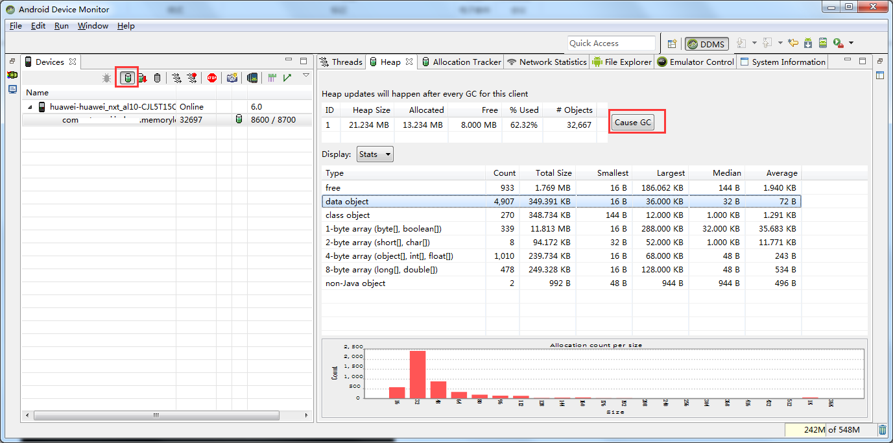
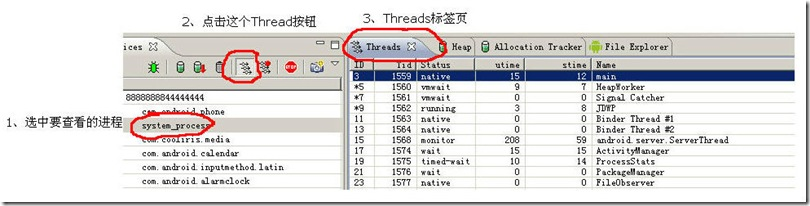

Dalvik Debug Monitor Server (DDMS) 是 ADT插件的一部分，其中有两项功能可用于内存检查 :

- heap 查看堆的分配情况
- allocation tracker跟踪内存分配情况

## 内存
### Update Heap

点击右侧的 Cause GC 按钮或工具栏上的  即可查看当前的堆情况。
主要关注两项数据：

- 	**Heap Size:** 堆的大小，当资源增加，当前堆的空余空间不够时，系统会增加堆的大小，若超过上限 (例如64M，视平台和具体机型而定)则会被杀掉
- 	**Allocated:**堆中已分配的大小，这是应用程序实际占用的内存大小，资源回收后，此项数据会变小

 查看操作前后的堆数据，看是否有内存泄漏 。对单一操作(比如添加页，删除页)进行反复操作，如果堆的大小一直增加，则有内存泄漏的隐患。

- **Data Object：**java object.
- **Class Object：**object of type Class, e.g. what you'd get from java.lang.String.class or myObject.getClass().The class object can't be garbage collected since classes are never unloaded. (they are referenced by their ClassLoader which could itself be referenced / loaded by another ClassLoader and you can't create Objects & use classes without them they need to stay and they need to keep a reference to their classes)
- **1,2,4,8-byte array：**Number of bytes per entry.    1-byte array: byte, boolean   2-byte array: char, short   4-byte array: float, int   8-byte array: double, long
- **non-Java object：**A non-Java Object is a piece of memory that isn't actually accessible from code written in Java. Essentially it's a blob of stuff that got stuck on the virtual heap but has no meaning to interpreted code. Shouldn't be much of that.

### Dump HPROF file

1. 点击按钮 Dump HPROF file 生成.hprof文件
2. 用命令行工具进行格式转换：hprof-conv src.hprof dest.hprof
3. 使用[MAT](mat.md)中导入分析

## CPU
### Update Threads

### Start Method Profiling

也可使用命令行
adb shell top -t -m 5 |grep packagename

- ID:   虚拟机分配的唯一的线程ID,在Dalvik里，它们是从3开始的奇数。 
- Tid：linux的线程ID号 
- Stauts：线程状态，比较多，有下面的一些 
-              running:  正在执行程序代码 
-              sleeping：执行了Thread.sleep() 
-              monitor：等待接受一个监听锁。 
-              wait:：Object.wait()，等待被其他线程唤醒 
-              native：正在执行native代码， 
-              vmwait：等待虚拟机，（这个不是很懂，高手指教，这个状态在什么情况下发生） 
-              zombie：线程在垂死的进程 
-              init：线程在初始化（我们不可能看到） 
-              starting：线程正在启动（我们不可能看到） 
- utime：执行用户代码的累计时间 
- stime：执行系统代码的累计时间 
- name：线程的名字

### Systrace
Start Method Profiling，可以统计一段时间内函数的调用频率