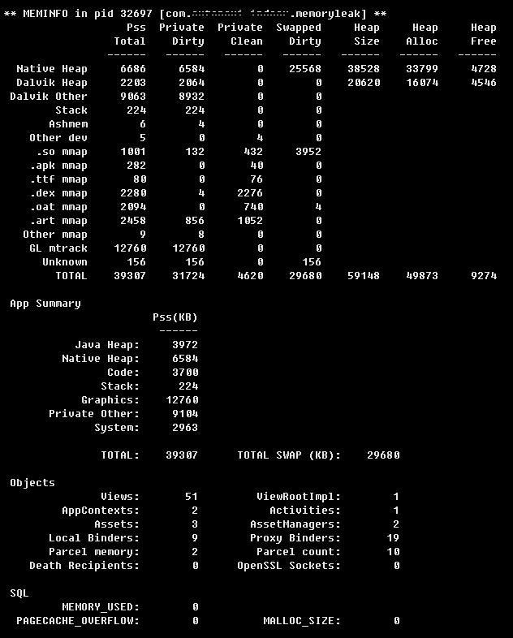

常用命令
	adb shell dumpsys meminfo
	adb shell dumpsys package  packagename
	adb shell dumpsys cpuinfo
系统属性等信息
	adb shell getprop | grep dalvik

## meminfo
	adb shell dumpsys meminfo packagename
或批量 

	for ((a=1;a<=100000;a++)) ; do adb shell dumpsys meminfo packagename |grep  "Native Heap:"; sleep 1; done

循环查看剩余内存

	for ((a=1;a<=100000;a++)) ; do adb shell cat /proc/meminfo |grep MemFree; sleep 1; done

	for ((a=1;a<=100000;a++)) ; do adb shell dumpsys meminfo packagename |grep  "Native Heap:"; sleep 1; done

- dalvikPrivateDirty：The private dirty pages used by dalvik。
- dalvikPss ：The proportional set size for dalvik.
- dalvikSharedDirty ：The shared dirty pages used by dalvik.
- nativePrivateDirty ：The private dirty pages used by the native heap.
- nativePss ：The proportional set size for the native heap.
- nativeSharedDirty ：The shared dirty pages used by the native heap.
- otherPrivateDirty ：The private dirty pages used by everything else.
- otherPss ：The proportional set size for everything else.
- otherSharedDirty ：The shared dirty pages used by everything else.
- PrivateDirty, which is basically the amount of RAM inside the process that can not be paged to disk (it is not backed by the same data on disk),
- and is not shared with any other processes.
- Another way to look at PrivateDirty is the RAM that will become available to the system
- when that process goes away (and probably quickly subsumed into caches and other uses of it).
- In one word，Priv Dirty(Total) is Uss。
